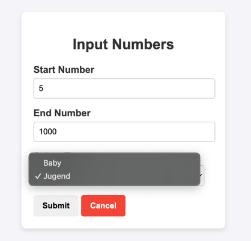

# Number_Example_Nathan

Eingabe der Start- und Endzahl

Der Benutzer gibt eine Anfangszahl und eine Endzahl ein, z. B. 5 und 1000.
Diese Eingaben sollen dann abgesendet und verarbeitet werden.
Speicherung in der Datenbank

Die eingegebenen Zahlen (Start- und Endzahl) werden in einer Datenbank gespeichert.
Zusätzlich sollen das Eingabedatum und weitere Metadaten abgespeichert werden.
Typauswahl für Kategorien

Der Benutzer kann einen Typ auswählen. Aktuell gibt es zwei Typen: "Jugend" und "Baby".
Diese Typen sollen dynamisch aus einer Tabelle in der Datenbank geladen werden, um später bei Bedarf weitere Typen hinzufügen zu können.
Vorschau der Eingaben

Eine Vorschau zeigt die zuletzt gespeicherten Eingaben an. Die Vorschau enthält den Zahlenbereich, den gewählten Typ und das Eingabedatum.
Technische Umsetzung in PHP, HTML und CSS

Die Backend-Logik und die Datenbankanbindung werden in PHP umgesetzt.
HTML und CSS werden für das Layout und die Benutzeroberfläche verwendet.

